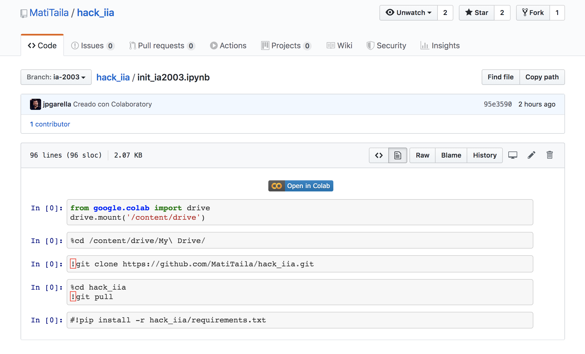
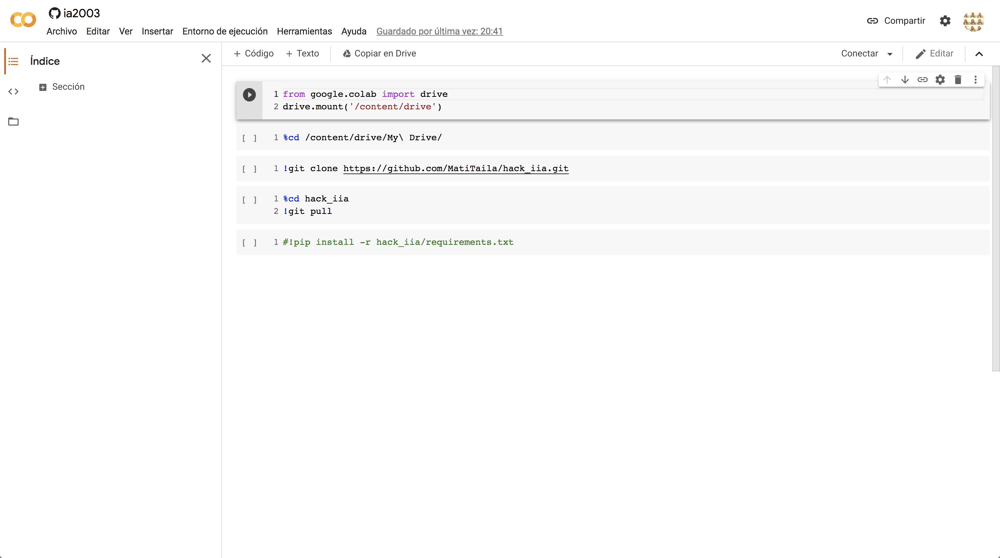
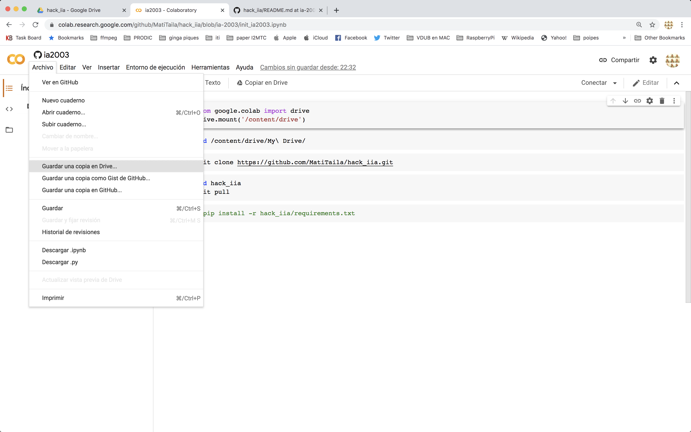
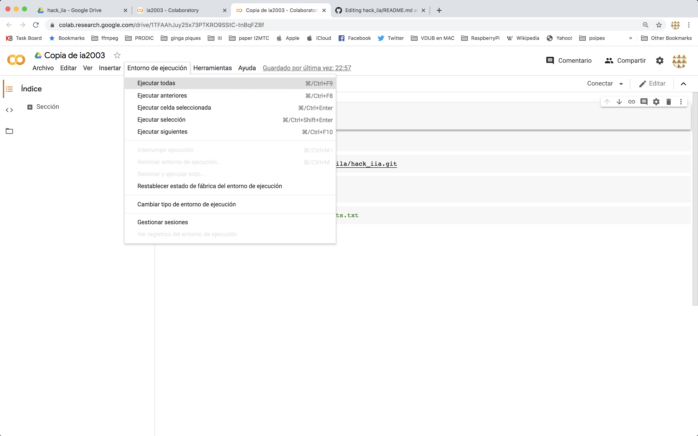
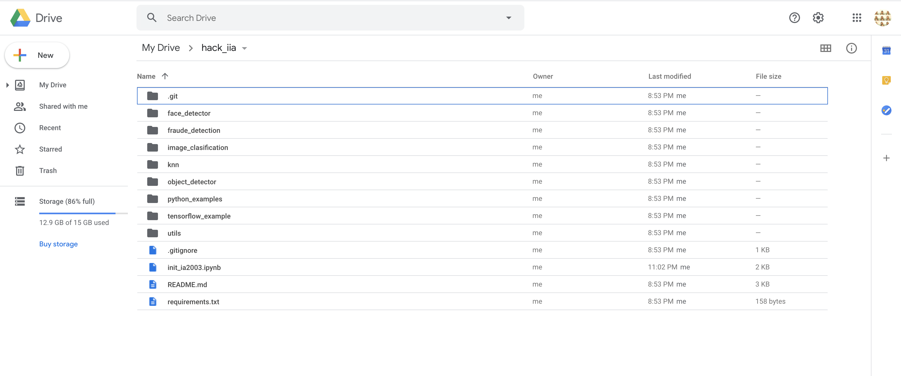
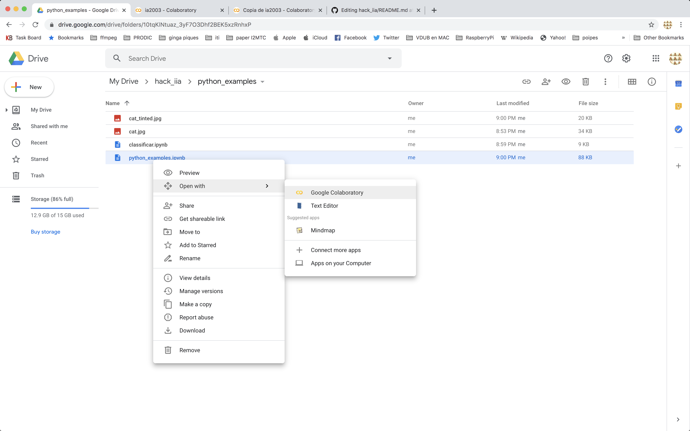
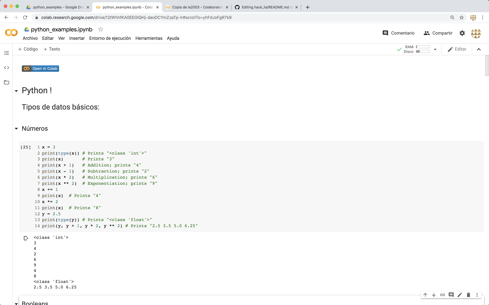

# hack_iia
Introducción a la Inteligencia Artificial - Curso Hack Academy

# Configuracion de entorno

## Google Colaboratory

1) Abrir el Jupyter notebook ```init_ia2003.ipynb``` (click izquierdo en el archivo) y darle click al botón **Open in Colab**



2)Se abrirá Google Colaboratory, cómo se puede ver debajo.



3) Luego ir a Archivo -> Guardar una copia en Drive...



3) Se abrirá una nueva ventana, donde se deberá ir a Entorno de Ejecución -> Ejecutar todas (ver captura de pantalla debajo)

 

4) Permitir el acceso al drive, para ello hacer click en el link, copiar el código y pegarlo en el párrafo del notebook.

  

5) Una vez que corra el notebook, en el drive aparecerá una carpeta nueva llamada ```hack_iia```. Ésta contendrá los notebooks utilizados en el curso. A continuación se ve un ejemplo de cómo se visualizaría en chrome.

  

6) Ahora corramos un notebook de ejemplo. Para ello abrir Google drive, navegar a la carpeta ```python_examples``` (dentro de hack_iia). Donde estará el notebook llamado ```python_examples.ipynb```. Luego, botón derecho -> abir con -> Google Colaboratory

   

7) Una vez que abrimos el notebook podemos correr parrafos. Comencemos por imprimir números en pantalla!

   

8) En hora buena! ya tienes la configuración del entorno realizada en Google Colaboratory y haz corrido un notebook!

## Linux/MacOS

Primero instalar python3.6 y git:

En Ubuntu (Linux):
```
$ sudo apt-get install python3-pip python3-dev git
```

En Maquina Virtual distribuida con Ubuntu (Linux) sólo este comando:
```
$ sudo apt install python3-pip git
```

En OSX debemos primero instalar Homebrew y git:
```
$ /usr/bin/ruby -e "$(curl -fsSL https://raw.githubusercontent.com/Homebrew/install/master/install)"
$ brew install git
$ brew install https://raw.githubusercontent.com/Homebrew/homebrew-core/f2a764ef944b1080be64bd88dca9a1d80130c558/Formula/python.rb
```

Una vez instalado Python en el sistema operativo correspondiente se debe continuar de la siguiente manera. Primero crear una carpeta por ejemplo "cursoai". Luego desde esa carpeta descargar el repositorio utilizando el siguiente comando:
```
$ git clone https://github.com/MatiTaila/hack_iia.git

```

Una vez descargado el repositorio, desde consola instalar "virtualenv" y crear un virtual environment con nombre "ha_env"

```
$ sudo pip3 install virtualenv
$ virtualenv -p python3 ha_env
```

Una vez creado se debe activar de la siguiente manera:

```
$ source ha_env/bin/activate
```
Se prosigue a instalar las dependencias:
```
$ pip3 install -r requirements.txt
```

Luego simplemente desde consola moverse al directorio "hack_iia" y levantar el entorno de desarrollo:
```
$ cd hack_iia
$ jupyter notebook
```
No olvidarse al terminar de trabajar ejecutar:
```
deactivate
```

## Windows

En Windows debemos primero instalar Anaconda:

```
Descargar Anaconda: https://repo.anaconda.com/archive/Anaconda3-5.2.0-Windows-x86_64.exe
```

Durante la instalación de Anaconda en un momento se pregunta si deseamos agregar las rutas a las variables de entorno. Es conveniente decir que SÍ. Si por alguna razón se nos pasó, debemos agregar a las variables de entorno las siguientes rutas:

```
C:\Users\<USUARIO>\Anaconda3
C:\Users\<USUARIO>\Anaconda3\Scripts
```

Una vez instalado Anaconda se debe instalar Virtualenv. El entorno virtual se crea con el siguiente comando:
```
conda create --name env python=3.5
```

Descargamos el repositorio del curso desde consola (en caso de no contar con git en la CMD, descargar desde el sitio oficial: https://git-scm.com):
```
git clone http://www.github.com/MatiTaila/hack_iia.git
```

Activamos el entorno virtual: 
```
activate env
```
Actualizamos el gestor de paquetes:
```
python -m pip install --upgrade pip
```
Para completar la instalación de los paquetes requeridos debemos **navegar hasta el directorio del repositorio** y luego ejecutar:
```
pip install -r hack_iia/requirements.txt --force-reinstall --no-cache-dir
```
Luego navegar hasta el directorio "hack_iia" y levantar el entorno de desarrollo con el siguiente comando:
```
jupyter notebook
```
No olvidarse al terminar de trabajar ejecutar:
```
deactivate
```

